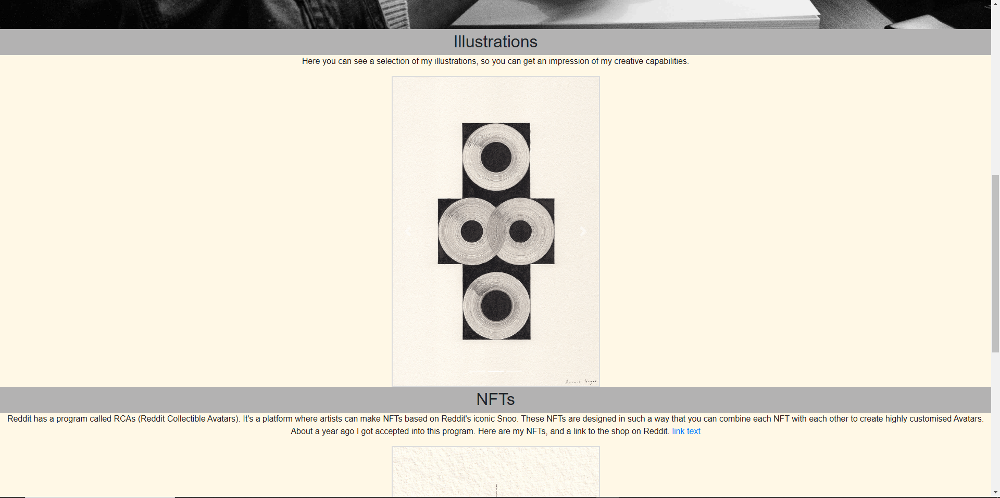

# [First Website Build]
For my job application as front-end developer I made a very basic version of my WordPress website that I have to sell my art. I did this to show the level of my skills, and also to show my thought process throughout the project.  

I started out with Chat GPT, and I used it throughout the project. I hope it's also clear I tried to do a lot myself, and to figure out what exactly everything does as I worked my way through the project.

### Result
First I let Chat GPT make me the necessary code to set up a basic website:

**Step 1: Create the Basic HTML Structure**

I added the following code into a 'index.html' file:
```
<!DOCTYPE html>
<html lang="en">
<head>
    <meta charset="UTF-8">
    <meta name="viewport" content="width=device-width, initial-scale=1.0">
    <title>My Simple Website</title>
    <link rel="stylesheet" href="styles.css">
</head>
<body>
    <header>
        <h1>Welcome to My Website</h1>
        <nav>
            <ul>
                <li><a href="#home">Home</a></li>
                <li><a href="#about">About</a></li>
                <li><a href="#contact">Contact</a></li>
            </ul>
        </nav>
    </header>
    <main>
        <section id="home">
            <h2>Home</h2>
            <p>This is the home section.</p>
        </section>
        <section id="about">
            <h2>About</h2>
            <p>This is the about section.</p>
        </section>
        <section id="contact">
            <h2>Contact</h2>
            <p>This is the contact section.</p>
            <form id="contactForm">
                <label for="name">Name:</label>
                <input type="text" id="name" name="name" required>
                <label for="email">Email:</label>
                <input type="email" id="email" name="email" required>
                <button type="submit">Submit</button>
            </form>
        </section>
    </main>
    <footer>
        <p>&copy; 2024 My Simple Website</p>
    </footer>
    <script src="scripts.js"></script>
</body>
</html>
```

**Step 2: Style With CSS**

I added the following code into a 'styles.css' file:
```
body {
    font-family: Arial, sans-serif;
    margin: 0;
    padding: 0;
    box-sizing: border-box;
}

header {
    background-color: #4CAF50;
    color: white;
    padding: 1em 0;
    text-align: center;
}

nav ul {
    list-style-type: none;
    padding: 0;
}

nav ul li {
    display: inline;
    margin: 0 10px;
}

nav ul li a {
    color: white;
    text-decoration: none;
}

main {
    padding: 20px;
}

section {
    margin-bottom: 20px;
}

footer {
    background-color: #333;
    color: white;
    text-align: center;
    padding: 10px 0;
    position: fixed;
    width: 100%;
    bottom: 0;
}

form {
    display: flex;
    flex-direction: column;
}

label {
    margin-bottom: 5px;
}

input {
    margin-bottom: 10px;
    padding: 5px;
}

button {
    background-color: #4CAF50;
    color: white;
    border: none;
    padding: 10px;
    cursor: pointer;
}

button:hover {
    background-color: #45a049;
}
```

**Step 3: Add Interactivity With JavaScript**

I added the following code into a 'scripts.js' file:
```
document.addEventListener('DOMContentLoaded', function() {
    const contactForm = document.getElementById('contactForm');

    contactForm.addEventListener('submit', function(event) {
        event.preventDefault();

        const name = document.getElementById('name').value;
        const email = document.getElementById('email').value;

        if (name && email) {
            alert(`Thank you, ${name}! We have received your message.`);
            contactForm.reset();
        } else {
            alert('Please fill out all fields.');
        }
    });
});
```

I added all of these files into a 'First Website Build' folder.

Here's the result:  


**Step 4: Add Header Image and Change Texts**

Here I'm creating my own homepage by customising the existing framework. 

First thing I did was add in a header image by adding the following code:
```
height: 720px;
    background-image: url(images/header-background.jpg);
    background-size: cover;
    background-repeat: no-repeat;
    background-position: center;
```
I also changed the header text and list items, and corresponding elements to say what I wanted them to say. 

To get the header text and list items to be centered both horizontally and vertically, while having the header and list items still be on two separate lines, I used the following css code: 

```
display: flex; /* Enable Flexbox */
align-items: center; /* Vertically center */
justify-content: center; /* Horizontally center */
flex-direction: column; /* Stack items vertically */
```

This is what the result was:  

  


**Step 5: Add in Illustration and NFT Carousels**

For the Illustrations and NFTs I want a carousel. To create these I added the following html code into each item section:
```
<!DOCTYPE html>
<html lang="en">
<head>
    <meta charset="UTF-8">
    <meta name="viewport" content="width=device-width, initial-scale=1.0">
    <title>Image Carousel</title>
    <link rel="stylesheet" href="styles.css">
</head>
<body>
    <div class="carousel">
        <div class="carousel-inner">
            <div class="carousel-item active">
                
            </div>
            <div class="carousel-item">
                
            </div>
            <div class="carousel-item">
                
            </div>
        </div>
        <button class="carousel-control prev" onclick="prevSlide()">&#10094;</button>
        <button class="carousel-control next" onclick="nextSlide()">&#10095;</button>
    </div>

    <script src="scripts.js"></script>
</body>
</html>
```

Then I added the following css code into the 'styles.css' file:
```
body {
    font-family: Arial, sans-serif;
    margin: 0;
    padding: 0;
    box-sizing: border-box;
}

.carousel {
    position: relative;
    max-width: 600px;
    margin: auto;
    overflow: hidden;
    border: 2px solid #ddd;
}

.carousel-inner {
    display: flex;
    transition: transform 0.5s ease-in-out;
}

.carousel-item {
    min-width: 100%;
    box-sizing: border-box;
}

.carousel-item img {
    width: 100%;
    display: block;
}

.carousel-control {
    position: absolute;
    top: 50%;
    width: auto;
    padding: 16px;
    margin-top: -22px;
    color: white;
    font-weight: bold;
    font-size: 18px;
    cursor: pointer;
    background-color: rgba(0, 0, 0, 0.5);
    border: none;
}

.carousel-control.prev {
    left: 0;
}

.carousel-control.next {
    right: 0;
}
```

And then I added the following JavaScript code into the 'scripts.js' file to make the carousel functional:
```
let currentIndex = 0;

function showSlide(index) {
    const slides = document.querySelectorAll('.carousel-item');
    if (index >= slides.length) {
        currentIndex = 0;
    } else if (index < 0) {
        currentIndex = slides.length - 1;
    } else {
        currentIndex = index;
    }
    
    const offset = -currentIndex * 100;
    document.querySelector('.carousel-inner').style.transform = `translateX(${offset}%)`;
}

function nextSlide() {
    showSlide(currentIndex + 1);
}

function prevSlide() {
    showSlide(currentIndex - 1);
}

// Automatically change slides every 3 seconds (optional)
setInterval(nextSlide, 3000);
```

Finally, I added the images I wanted into the carousels by inserting the relative image paths in the right place into the following piece of code, as well as copying & altering it to fit the amount of images I wanted to have in there.
```
<div class="carousel-item active">
                
            </div>
```

**Troubleshooting**  

After adding in the second carousel, I noticed it wouldn't revolve either automatically or manually. Also, the first carousel now had empty frames. My guess is from the second carousel.

I realised the class for the second carousel was named the same. I added a '1' to the class name to fix this. I also tried adding the class to the existing function is JS with a ```&&```, but this didn't work. I copied the function and changed the class name. This did not work either. I forgot to also copy the css code and alter it accordingly. It took a while to change all necessary variables. I've added a 1 to all necessary variable names.  

As I didn't want to use Chat GPT for this part, since I know a little JS, it took me a while to figure out which variables needed changing.
After realising using the same function wasn't going to work, I remembered that you use a comma, not '&&' to add another value to a parameter.

So, after giving up on trying to solve the double carousel issue on my own, I quickly find out I had quite the wrong conception of html classes. I thought a class name worked the same as a variable name, giving it its unique identifier. Instead, there's a specific id you can give the carousel. While classes are also unique names you can give, they encompass element groups, not single elements like id's do. 

I was trying to modify the carousel function I initially had, so it would work for two carousels, but even with Chat GPT I wasn't getting it. So I copied the Chat GPT function for two carousels.


The final thing that seemed to fix the issue was adding ```'carousel1', 'carousel2'``` to the nextSlide & prevSlide function parameter in the carousel-control next & carousel-control prev classes, like so: 

```
<button class="carousel-control prev" onclick="prevSlide('carousel1', 'carousel2')">&#10094;</button>
<button class="carousel-control next" onclick="nextSlide('carousel1', 'carousel2')">&#10095;</button>
```
I had to start with the other carousel than the one I was working in. I don't yet understand why, but I want to continue for now.


Although it's not a functioning example, here's a screenshot:  

  


**Step 6: Make text adjustments**

First thing I did was centre align all my text. I first tried:
```
.nfts {
    text-align: center;
}
```

I quickly realised this did not work. Since that was specifically for classes, I figured there's another way for id's. This appeared to be using a '#' instead of a '.'. So it became the following:
```
#nfts {
    text-align: center;
}
```

I did this for all texts. I also wanted to narrow the width of the text. I did this with the ```width:``` property.


I changed the width of the carousel, and also added in an enlargement function. I needed to add in certain code in html and JS. 

html:
```
<!-- Modal -->
<div class="modal fade" id="imageModal" tabindex="-1" aria-labelledby="exampleModalLabel" aria-hidden="true">
    <div class="modal-dialog modal-dialog-centered">
        <div class="modal-content">
            <div class="modal-header">
                <h5 class="modal-title" id="exampleModalLabel">Image</h5>
                <button type="button" class="close" data-dismiss="modal" aria-label="Close">
                    <span aria-hidden="true">&times;</span>
                </button>
            </div>
            <div class="modal-body">
                
            </div>
        </div>
    </div>
</div>
```

JS:
```
<script>
    $('#imageModal').on('show.bs.modal', function (event) {
        var button = $(event.relatedTarget); // Button that triggered the modal
        var imageSrc = button.data('image'); // Extract info from data-* attributes
        var modal = $(this);
        modal.find('#modalImage').attr('src', imageSrc);
    });
</script>
```

I also needed to add in certain code in my existing html carousel element so that the right things are referenced.

**Troubleshooting**  

I was doing things wrong, so for efficiency’s sake I let Chat GPT fix my code. Now it works. It seems to be a formatting problem, and adding the code in the right place. I'm also learning why some elements were suddenly disappearing on my website. For some reason I had extra ```</html>```, and ```</body>``` closing tags in places, and the placement of the code seemed to be off in those places. I couldn't quite figure out what exactly was wrong with my first html code, but at least I learned something. If I had more time I could compare each line, but I don't have enough time.


Next thing is to put the text inside a box. I did this by adding the following element and adding all the text into that class:

```
.full-width-box-text {
    width: 100%; /* Make the box span the entire width */
    background-color: #0c0909; /* Add a background color */
    padding: 20px; /* Add some padding */
    border: 1px solid #ccc; /* Add a border */
    box-sizing: border-box; /* Include padding and border in the box's total width */
}
```

I also removed the max width of the sections, because these were limiting the box width too. I didn't quite understand how the section id's worked when I set that limit. I do now. Added to that, I put all the text into a 'text' class, and changed the text colour. Here's a screenshot:  


**Step 7: Final adjustments**

There's still a couple things I want to do before I call the website done:

-   Make the header image full page.
-   Add sub headers into boxes.
-   Make the box colours appealing.
-   Lock footer to bottom of webpage, not bottom of screen.
-   Add a background colour or image.
-   Add in reddit link.
-   Change font.
-   Left align text.
-   Change font sizes.
-   Add some breathing space to the elements.


**Make header image full page:**  

For this I needed to set the header height to ```100vh```.  


**Add sub headers into boxes:***  

For this I needed to create a new class and add it to the sub header elements:
    
    ```
    .full-width-box-subheader {
        width: 100%; /* Make the box span the entire width */
        background-color: #0c0909; /* Add a background color */
        padding: 20px; /* Add some padding */
        border: 1px solid #ccc; /* Add a border */
        box-sizing: border-box; /* Include padding and border in the box's total width */
    }
    ```

This looks like shit. I'm removing the text headers. Even after removing the text headers I'm not happy with it, but I've wasted too much time already, so this is it.

**Troubleshooting**

I was trying to get my header boxes to reach the edges of the screen. I was being told by Chat GPT that I needed to make sure the padding was set to 0px for the surrounding elements. I created a class for the main element, and this worked. I thought 'I'll use the same class to create a background.' To do this I changed the class to the body element. When I did this, the boxes got their padding again. I'm not going to try to figure it out right now, but I thought it was interesting. I'll just make two classes, one for the body and background, and one for the main and the boxes in it.



**Lock Footer to Bottom of Webpage:**

It was a right pain to get the footer to sit at the bottom of the page. It was in a ```fixed``` position, and it didn't take long to find out I needed to change that to ```relative```. While looking for a solution, however, I had created another class ```.footer``` which was fudging things up. After removing it all was a oké. Since a screenshot doesn't prove if it actually worked, I'm leaving it out.

**Add a Background Image:**

I added a paper texture to match the drawings. To do this I added the following code:

```
    background-image: url('images/Backgound Image/Paper Background Texture A4-20210506_14335531.png');
    background-position: center;
    background-repeat: no-repeat;
    background-size: stretch;
```

**Add in Reddit Link:**

This is done with a simple ```<a href="URL">Link Text</a>```.

**Change font:**

I chose for Merriweather. To add this I made a class in CSS like so:

```
.merriweather-regular {
    font-family: "Merriweather", serif;
    font-weight: 400;
    font-style: normal;
  }
```

Then I added the following into the head in HTML to reference the font from Google Fonts:

```
    <link rel="preconnect" href="https://fonts.googleapis.com">
    <link rel="preconnect" href="https://fonts.gstatic.com" crossorigin>
    <link href="https://fonts.googleapis.com/css2?family=Merriweather:ital,wght@0,300;0,400;0,700;0,900;1,300;1,400;1,700;1,900&display=swap" rel="stylesheet">
```

Finally I added a style CSS block into the body of the HTML to ensure the right font is being used:

```
    <style>
        body {
          font-family: 'Merriweather', serif;
        }
      </style>
```


Come to find out, I don't need to add the CSS class. At least not now because I added the CSS block into HTML directly. In this case I'll keep it like this, but I imagine it could be cleaner to have the class in the CSS file to then reference it from there. 


**Left align text:**

This is easily done with the ```left-align: left;``` property added into the text class in CSS. However, I didn't like how it looked. I reverted it and decided to change the width of the text by changing the entire section widths because I also wanted to change the box width. This wasn't necessarily the best choice, since it means I can't change the individual elements, but it was the easiest choice for now. I did this by adding a ```width: 800px;``` property to the section classes.


**Change font size:**

I did this by adding the ```font-size: 14px;``` property to the font CSS block in the HTML body. I couldn't reduce the font size as much as I'd preferred because of readability.

**Add some breathing space to elements**:

I did this by adding some padding to the bottom of the section classes, and both top and bottom of the text class.


**Final note:**

I needed to add in some last images to the first carousel, and while doing so, the carousel stopped working. What I failed to notice as I copied the code, is that I had made multiple images active. I also realised that I needed to add more of these ```<li data-target="#carousel1" data-slide-to="2"></li>```, so that the carousel would slide through all images. 

Final product:

  
  
  


